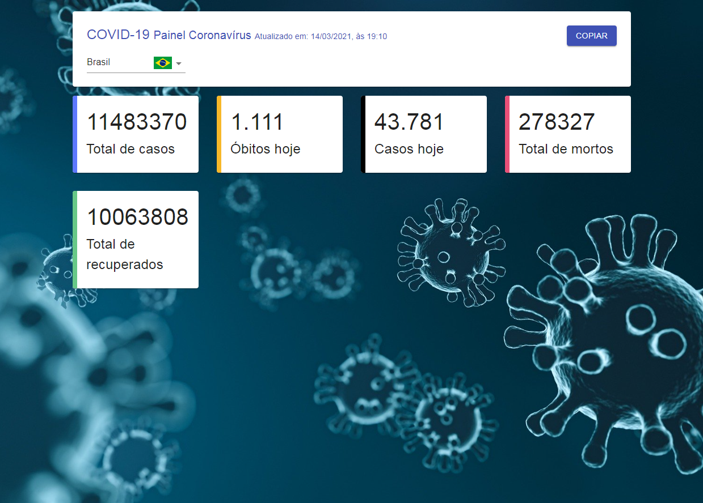

<h1 align="center">
    
</h1>

<br />

<h3 align="center">
    <a href="https://covid19-panel.vercel.app">Acessar a demonstração</a>
<h3 >

<br />

# Indice

- [Sobre](#-sobre)
- [Tecnologias Utilizadas](#-tecnologias-utilizadas)
- [Como baixar o projeto](#-como-baixar-o-projeto)

## 🔖 &nbsp; Sobre

O projeto **Covid-19 Panel** é uma apliacação simples, que tem por objetivo consumir uma API e exibir num painel os dados atualizados sobre a situação do coronavírus no mundo.

---

## 🚀 &nbsp; Tecnologias utilizadas

Esse projeto foi desenvolvido com as seguintes tecnologias:

- [JavaScript](https://developer.mozilla.org/pt-BR/docs/Learn/JavaScript/)
- [React](https://reactjs.org)
- [Material-UI](https://material-ui.com)
- [Styled Components](https://styled-components.com)

---

##  📁 &nbsp; Como baixar o projeto

```bash

    # Clonar o repositório
    $ git clone https://github.com/yangvaz/covid19-panel

    # Entrar no diretório
    $ cd covid19-panel

    # Instalar as dependências
    $ yarn install

    # Iniciar o projeto
    $ yarn start
```

---

Desenvolvido por Yan Garcia 🥑 